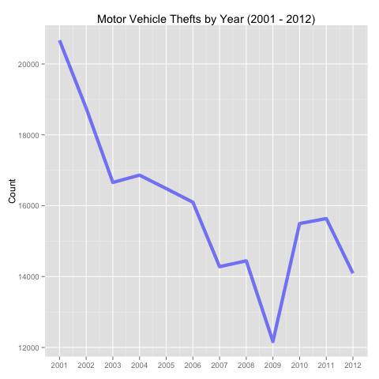
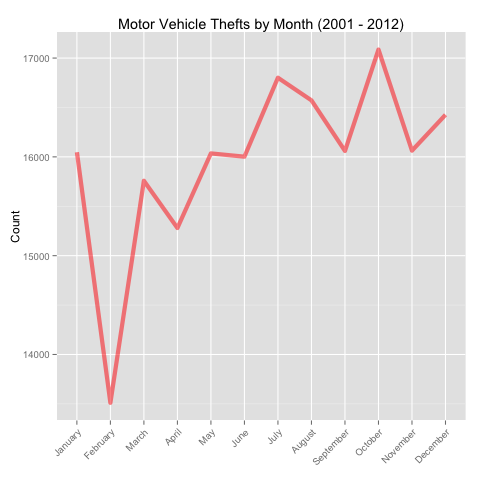
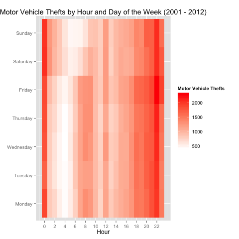
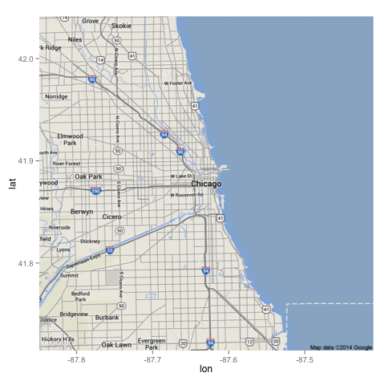
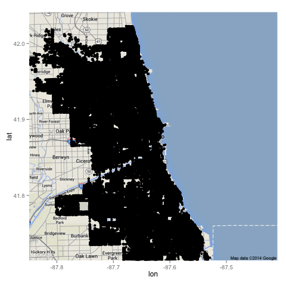
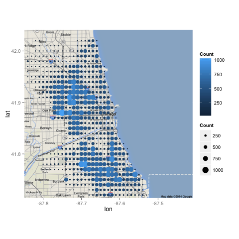
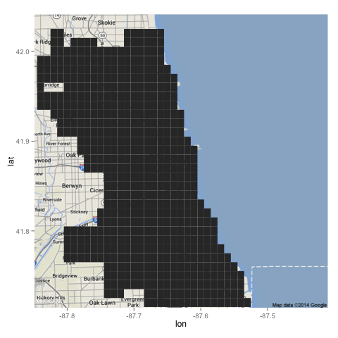
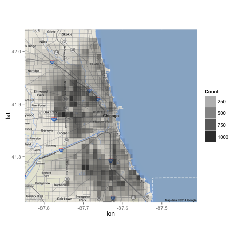
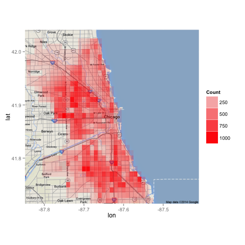

<h1>Visualizing Motor Vehicle Thefts in Chicago (2001 - 2012)</h1>

<h2>Objective</h2>
Visualize motor vehicle thefts in Chicago between January 1, 2001 and December 31, 2012.

<h2>About the Data</h2>
This data comes from the <a href='http://gis.chicagopolice.org/' target='_blank'>Chicago Police Department</a>. It contains information about motor vehicle thefts in Chicago between January 1, 2001 and December 31, 2012.

<h2>Data Preparation</h2>
<h6>1. Loading and viewing data</h6>
    > mvt <- read.csv('mvt.csv', stringsAsFactors=FALSE)
    > head(mvt)
		Date Latitude Longitude
    1 12/31/12 23:15 41.75628 -87.62164
    2 12/31/12 22:00 41.89879 -87.66130
    3 12/31/12 22:00 41.96919 -87.76767
    4 12/31/12 22:00 41.76933 -87.65773
    5 12/31/12 21:30 41.83757 -87.62176
    6 12/31/12 20:30 41.92856 -87.75400

<h6>2. Creating new columns with extracted information</h6>

    > str(mvt)
    'data.frame':	191641 obs. of  3 variables:
     $ Date     : chr  "12/31/12 23:15" "12/31/12 22:00" "12/31/12 22:00" "12/31/12 22:00" ...
     $ Latitude : num  41.8 41.9 42 41.8 41.8 ...
     $ Longitude: num  -87.6 -87.7 -87.8 -87.7 -87.6 ...
    > 
    > mvt$Date <- strptime(mvt$Date, format="%m/%d/%y %H:%M")
    > range(mvt$Date)
    [1] "1/1/01 0:01" "9/9/12 9:50"
    >
    > mvt$Year <- format(mvt$Date, '%Y')
    > mvt$Month <- months(mvt$Date)
    > mvt$Day <- weekdays(mvt$Date)
    > mvt$Hour <- mvt$Date$hour
    >
    > head(mvt)
		     Date Latitude Longitude Year    Month    Day Hour
    1 2012-12-31 23:15:00 41.75628 -87.62164 2012 December Monday   23
    2 2012-12-31 22:00:00 41.89879 -87.66130 2012 December Monday   22
    3 2012-12-31 22:00:00 41.96919 -87.76767 2012 December Monday   22
    4 2012-12-31 22:00:00 41.76933 -87.65773 2012 December Monday   22
    5 2012-12-31 21:30:00 41.83757 -87.62176 2012 December Monday   21
    6 2012-12-31 20:30:00 41.92856 -87.75400 2012 December Monday   20

<h2>Visualizations Process: Line Graphs and Heat Map</h2>
<h6>1. Installing and loading 'ggplot2' package</h6>
    > install.packages('ggplot2')
    > library(ggplot2)

<h6>2. Motor vehicle thefts by year (2001 - 2012)</h6>
    > mvtByYear <- as.data.frame(table(mvt$Year)) 
    > colnames(mvtByYear) <- c('Year', 'Count')
    > mvtByYear$Year <- as.numeric(as.character(mvtByYear$Year))
    >
    > ggplot(mvtByYear, aes(x = Year, y = Count)) + 
    +   geom_line(aes(group = 1), size = 2, alpha = 0.5, color = 'blue') + 
    +   scale_x_continuous(breaks = 2001:2012) + 
    +   theme(axis.title.x = element_blank()) + 
    +   ggtitle('Motor Vehicle Thefts by Year (2001 - 2012)')

<h6>3. Motor vehicle thefts by month (2001 - 2012)</h6>

    > mvtByMonth <- as.data.frame(table(mvt$Month))
    > colnames(mvtByMonth) <- c('Month', 'Count')
    > mvtByMonth$Month <- factor(mvtByMonth$Month, 
    +                            levels = c('January', 'February', 'March', 'April',
    +                                       'May', 'June', 'July', 'August', 'September',
    +                                       'October', 'November', 'December'))
    >
    > ggplot(mvtByMonth, aes(x=Month, y=Count)) + 
    >   geom_line(aes(group=1), size = 2, alpha = 0.5, color = 'red') + 
    >   theme(axis.title.x = element_blank(), 
    >	      axis.text.x = element_text(angle = 45, hjust = 1)) +
    >   ggtitle('Motor Vehicle Thefts by Month (2001 - 2012)')

<h6>4. Motor vehicle thefts by day of the week (2001 - 2012)</h6>

    > mvtByDay <- as.data.frame(table(mvt$Day))
    > colnames(mvtByDay) <- c('Day', 'Count')
    > mvtByDay$Day <- factor(mvtByDay$Day,
    +                            levels = c('Monday', 'Tuesday', 'Wednesday', 'Thursday',
    +                                       'Friday', 'Saturday', 'Sunday'))
    >
    > ggplot(mvtByDay, aes(x = Day, y = Count)) + 
    +   geom_bar(aes(fill = Day), stat = 'identity') +
    +   theme(axis.title.x = element_blank()) + 
    +   ggtitle('Motor Vehicle Thefts by Day of the Week (2001 - 2012)')

<h6>5. Motor vehicle thefts by hour (2001 - 2012)</h6>

    > mvtByHour <- as.data.frame(table(mvt$Hour))
    > colnames(mvtByHour) <- c('Hour', 'Count')
    > mvtByHour$Hour <- as.numeric(as.character(mvtByHour$Hour))
    >
    > ggplot(mvtByHour, aes(x=Hour, y=Count)) + 
    +   geom_line(aes(group=1), size=2, alpha=0.5, color = 'darkgreen') +
    +   ggtitle('Motor Vehicle Thefts by Hour (2001 - 2012)')

<h6>6. Motor vehicle thefts by month and year (heatmap)</h6>

    > mvtByMonthYear <- as.data.frame(table(mvt$Month, mvt$Year))
    > colnames(mvtByMonthYear) <- c('Month', 'Year', 'Count')
    > mvtByMonthYear$Year <- as.numeric(as.character(mvtByMonthYear$Year))
    > mvtByMonthYear$Month <- factor(mvtByMonthYear$Month, 
    +                                levels = c('January', 'February', 'March', 'April',
    +                                           'May', 'June', 'July', 'August', 'September',
    +                                           'October', 'November', 'December'))
    >
    > ggplot(mvtByMonthYear, aes(x = Month, y = Year)) +
    +   geom_tile(aes(fill = Count)) + 
    +   theme(axis.title.x = element_blank(), 
    +         axis.text.x = element_text(angle = 45, hjust = 1)) +
    +   scale_fill_gradient(low = 'white', high = 'red') +
    +   scale_y_continuous(breaks = 2001:2012) + 
    +   ggtitle('Motor Vehicle Thefts by Month and Year (2001 - 2012)')

<h6>7. Motor vehicle thefts by hour and day of the week (heatmap)</h6>

    > mvtByHourDay <- as.data.frame(table(mvt$Day, mvt$Hour))
    > colnames(mvtByHourDay) <- c('Day', 'Hour', 'Count')
    > mvtByHourDay$Day <- factor(mvtByHourDay$Day, 
    +                                levels = c('Monday', 'Tuesday', 'Wednesday', 'Thursday',
    +                                           'Friday', 'Saturday', 'Sunday'))
    > mvtByHourDay$Hour <- as.numeric(as.character(mvtByHourDay$Hour))
    >
    > ggplot(mvtByHourDay, aes(x = Hour, y = Day)) + 
    +   geom_tile(aes(fill = Count)) + 
    +   scale_fill_gradient(name = 'Motor Vehicle Thefts',
    +                       low = 'white', high = 'red') + 
    +   theme(axis.title.y = element_blank()) + 
    +   ggtitle('Motor Vehicle Thefts by Hour and Day of the Week (2001 - 2012)') +
    +   scale_x_continuous(breaks = seq(from=0, to=23, by=2))

<h2>Visualization Process: Maps</h2>
<h6>0. Installing and loading 'maps' and 'ggmap' packages</h6>

    > install.packages('maps')
    > install.packages('ggmap')
    > library(maps)
    > library(ggmap)

<h6>1. Loading a map of Chicago and plotting</h6>

    > chicago <- get_map(location = "chicago", zoom = 11)
    > ggmap(chicago)

<h6>2. Plot all cases of motor vehicle thefts between 2001 and 2012 raw</h6>

    > ggmap(chicago) + 
    +   geom_point(data = mvt, 
    +              aes(x = Longitude, y = Latitude))

<h6>3. Plot the first 1000 cases of motor vehicle thefts in the data frame</h6>

    > ggmap(chicago) + 
    +   geom_point(data = mvt[1:1000,], 
    +              aes(x = Longitude, y = Latitude))

<h6>Create a data frame with theft counts by sub-regions</h6>

    > mvtByLongLat <- as.data.frame(table(round(mvt$Longitude, 2), round(mvt$Latitude, 2)))  # round the longitude and latitude coordinates to 2 decimal places
    > colnames(mvtByLongLat) <- c('Longitude', 'Latitude', 'Count')
    > head(mvtByLongLat)
      Longitude Latitude Count
    1    -87.93    41.64     0
    2    -87.92    41.64     0
    3    -87.91    41.64     0
    4     -87.9    41.64     0
    5    -87.89    41.64     0
    6    -87.88    41.64     0

<h6>Convert the Longitude and Latitude variables to numberic variables</h6>
    > str(mvtByLongLat)
    'data.frame':	1638 obs. of  3 variables:
     $ Longitude: Factor w/ 42 levels "-87.93","-87.92",..: 1 2 3 4 5 6 7 8 9 10 ...
     $ Latitude : Factor w/ 39 levels "41.64","41.65",..: 1 1 1 1 1 1 1 1 1 1 ...
     $ Count    : int  0 0 0 0 0 0 0 0 0 0 ...
    > mvtByLongLat$Longitude <- as.numeric(as.character(mvtByLongLat$Longitude))
    > mvtByLongLat$Latitude <- as.numeric(as.character(mvtByLongLat$Latitude))
    > head(mvtByLongLat)
      Longitude Latitude Count
    1    -87.93    41.64     0
    2    -87.92    41.64     0
    3    -87.91    41.64     0
    4    -87.90    41.64     0
    5    -87.89    41.64     0
    6    -87.88    41.64     0

<h6>Plot points on the Chicago map</h6>

    > ggmap(chicago) + 
    +   geom_point(data = mvtByLongLat,
    +              aes(x = Longitude, y = Latitude, color = Count, size = Count))

<h6>Remove regions with 0 theft case and r-eplot with a better color scheme</h6>
    > head(mvtByLongLat)
      Longitude Latitude Count
    1    -87.93    41.64     0
    2    -87.92    41.64     0
    3    -87.91    41.64     0
    4    -87.90    41.64     0
    5    -87.89    41.64     0
    6    -87.88    41.64     0
    > mvtByLongLat <- subset(mvtByLongLat, Count != 0)
    > head(mvtByLongLat)
       Longitude Latitude Count
    33    -87.61    41.64     3
    40    -87.54    41.64     1
    74    -87.62    41.65    54
    75    -87.61    41.65    60
    76    -87.60    41.65    28
    77    -87.59    41.65     1
    >
    > ggmap(chicago) + 
    +   geom_point(data = mvtByLongLat,
    +              aes(x = Longitude, y = Latitude, color = Count, size = Count)) + 
    +   scale_color_gradient(low = 'white', high = 'red') +
    +   xlab('Longitude') + 
    +   ylab('Latitude') + 
    +   ggtitle('Map of Motor Vehicle Thefts (2001 - 2012)')

<h6>Re-plot to create a map with heatmap rendition</h6>
    > ggmap(chicago) + 
    +   geom_tile(data = mvtByLongLat,
    +             aes(x = Longitude, y = Latitude))

    > ggmap(chicago) + 
    +   geom_tile(data = mvtByLongLat,
    +             aes(x = Longitude, y = Latitude, alpha = Count))

    > ggmap(chicago) + 
    +   geom_tile(data = mvtByLongLat,
    +             aes(x = Longitude, y = Latitude, alpha = Count),
    +             fill = 'red')

    > ggmap(chicago) + 
    +   geom_tile(data = mvtByLongLat,
    +             aes(x = Longitude, y = Latitude, alpha = Count),
    +             fill = 'red') + 
    +   xlab('Longitude') + 
    +   ylab('Latitude') +
    +   ggtitle('Map of Motor Vehicle Thefts (2001 - 2012)')

