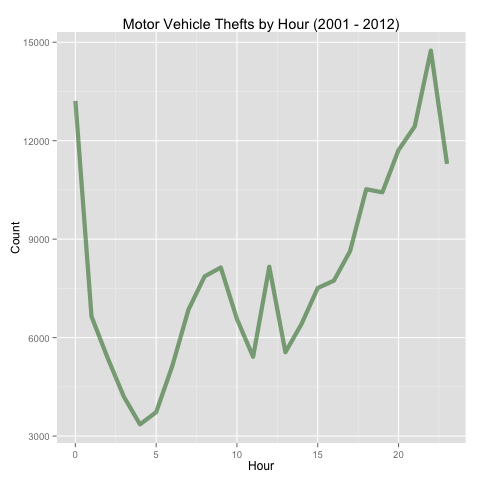

<h1>Visualizing Motor Vehicle Thefts in Chicago (2001 - 2012)</h1>

<h2>Objective</h2>
Visualize motor vehicle thefts in Chicago between January 1, 2001 and December 31, 2012.

<h2>About the Data</h2>
This data comes from the <a href='http://gis.chicagopolice.org/' target='_blank'>Chicago Police Department</a>.

<h2>Visualizations</h2>

